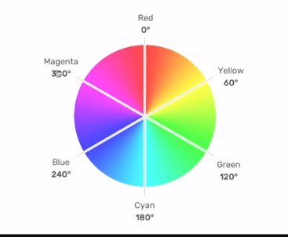

# CSSAnimation 01

Animista.net
Esse site contém vários exemplos de animações

- [x] Faça o quadrado ir de um lado para o outro na
      página. Fazer ele ficar parado no ponto oposto ao início.

@keyframes move {100% {transform: translateX(calc(100vw - 100% - 16px))}}

- inicio e fim: 0% e 100%, from to
- linha do tempo
- `keyframes` nome_da_animacao

- 1. animation-name:
- 2. animation-duration:
- 3. animation-fill-mode:

## Animation2

- [x] Reverta a animação
- [x] Fazer o quadrado ir e voltar ao ponto inicial
- [x] Fazer quadrado animar sem fim

animation-direction: reverse;
animation-iteration-count: infinite;

- mudar a direção da animação
- adicionar propriedades na linha do tempo (50%)
- definir quantas vezes a animação irá acontecer

- 4. animation-direction:

## Animation 3

- [x] Faça a animação esperar 2s para iniciar
      animation-delay: 2s;
- [x] Teste outras funcionalidades de tempo
      animation-timing-function: ease-in-out
      animation-timing-function: steps(10)

- fazer a animação começar depois de x tempo
- cubic-bezier(x1, y1, x2, y2)
- ease / ease-in / ease-out / ease-in-out / linear / steps

- 5. animtion-delay:
- 6. animation-timing-function

## Animation4

- [x] Quando passar o mouse em cima do quadrado, faça
      a animação parar
- [x] Faça o quadrado piscar sem parar

- iniciar ou pausar uma animação
- múltiplas animações
- shorthand

- 7. animation-play-state

## HUE

## CSS Resumo

<https://efficient-sloth-d85.notion.site/CSS-b75bbf131c394619abad3a8befd479f1#f15a5a14d7394da98ac57ef70758ef95>
