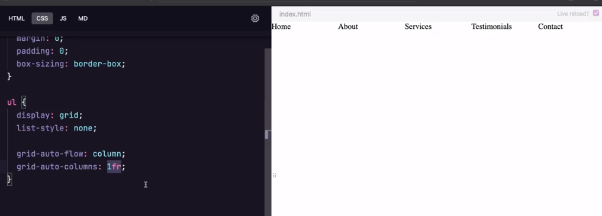

# Propriedades Fundamentais

Todo grid é composto de 2 principais grupos:
`container: o pai` e `itens: o(s) filhos`

## Container (pai)

- display: grid;
- grid-template;
  - grid-template-colums;
  - grid-template-rows;
  - grid-template-areas;
- gap;
  - row-gap;
  - column-gap;

## Itens (filhos)

- grid-column;

  - grid-column-start;
    -grid-column-end;

- grid-row;
  - grid-row-start;
  - grid-row-end;

## Propriedades de alinhamento

Existem 9 propriedades fundamentais

**6 aplicadas em container**
`align-content`
`justify-content`
`place-content`

`align-itens`
`justify-itens`
`place-itens`

**3 aplicadas em itens**
`align-self`
`justify-self`
`place-self`

Então podemos separar em 3 grupos:
`align`, `justify`, `place`

E cada um deles irá observar ou o

- conteúdo do elemento `content`
- itens do elemento `itens`
- o próprio elemento `self`

Content

align-content: space-around;

justify-content: center;

place é a junção do align e justify

align-itens: start;

justify-itens: start;

align-self: end;

## Propriedades Auto

- grid-auto-flow
- grid-auto-rows
- grid-auto-columns

grid-auto-flow: column;
grid-auto-columns: 1fr;

## Grid ou Flex

- Observe o layout e qual possui a menor complexidade
