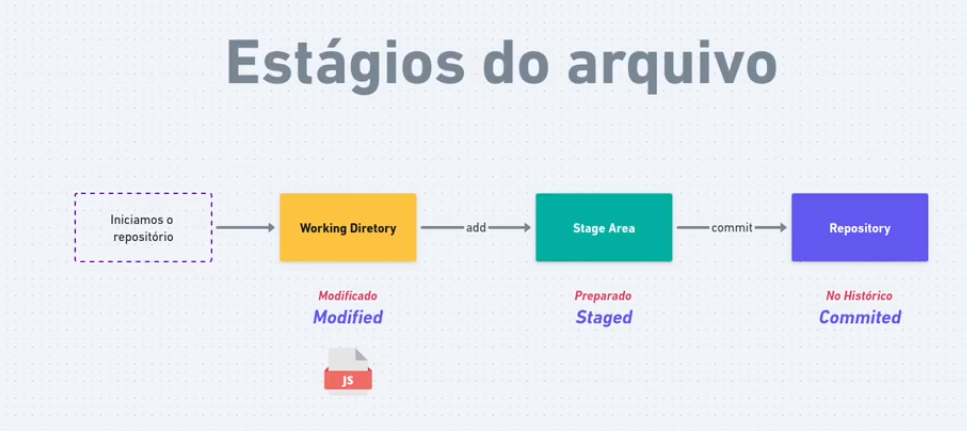
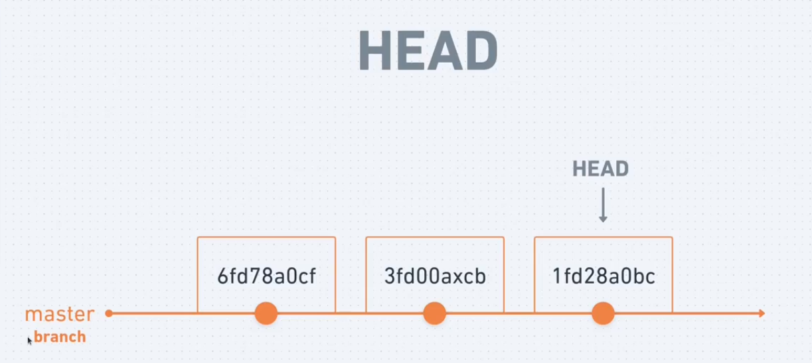

# Iniciar

  git init

## Nome de usuario
  
  git config --global user.name "vinicius"

## email

  git config --global user.email "<vtrentin15@gmail.com>"

## Verificar dados

  git --list
  // Apertar "q" para sair

## Atualizar arquivos

  git add .

## Historico de commits

  git log
  git log --oneline
  git log -n 3
  // ultimos 3 commits

## Estagios do arquivo

  

## Ver estagios

  git status

## HEAD

  Eh um ponteiro, que mostra qual foi o ultimo commit do projeto

## Comparar diferenças

  git diff

## Restaurar

  git restore .
  git restore nome_do_arquivo
  // volta para o conteudo do ultimo commit

## Restaurar para Staged

  git restore --staged .

## Renomear commit

  git commit --amend -m "texto corrigido"

## Desfazer commit
  
  git reset --soft HEAD~1

## Consultar meu endereço remoto

  git remote --v

## Desiginorar arquivos

  git rm -r  --cached .
  // no GitHub fica salvo os arquivos ignorados do gitignore

## Pasta vazia

  .gitkeep
  // arquivo dentro da pasta para ser rastreada

## Clonar repositorio

  git clone <git@github.com>:vitrentin/reviewGitHub.git
  
## Atualizar mudanças em outra maquina ou pessoa

  git pull

## Site reame.so

  Ajuda a criar um README com preview

## Documentação Rocketseat

  <https://storage.googleapis.com/golden-wind/explorer/material-rico/Documentacao_Git.pdf>
