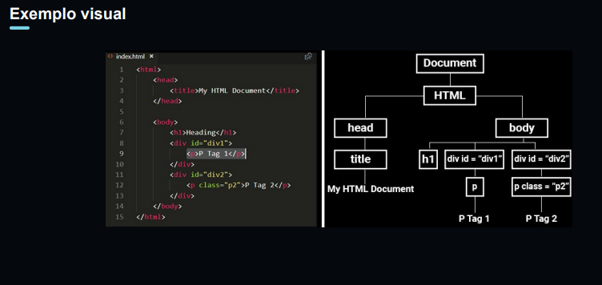
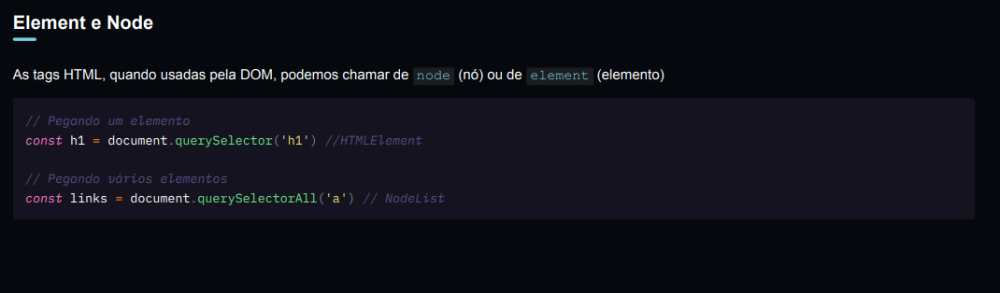
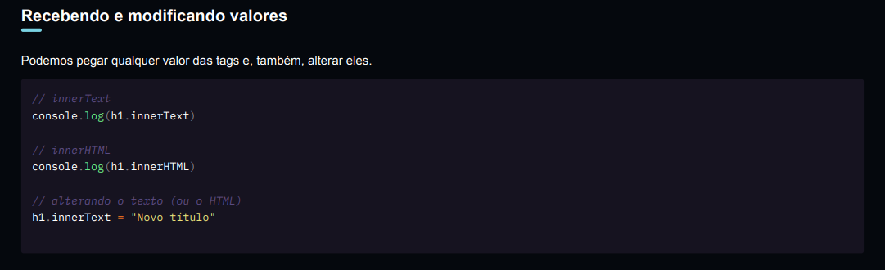
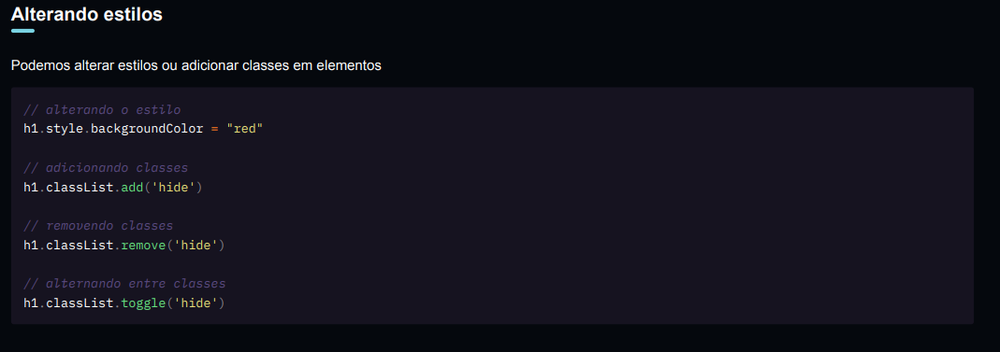

# O que é DOM?

- Document Object Model

  Modelagem do documento como objeto JavaScript

- Representação do HTML em objetos JavaScript

  Atributos (propriedades) e métodos (funcionalidades)

- Criado pelo navegador (browser)

  É uma interface (API) usada no navegador

## Pra que serve?

- JavaScript usa a DOM para se conectar ao HTML

  DOM não é o JavaScript

- Manipular o HTML com JavaScript

  Modificar o HTML, os estilos e até disparar ações

## Dev Tools

Através das ferramentas do desenvolvedor Dev Tools , observaremos a DOM.

// Objeto global presente em qualquer página no navegador

window

// Representação do documento

document

## Exemplo visual

## Manipulando a DOM

### Element e Node

QuerySelector (seletor de pesquisa)

### Recebendo e modificando valores

### Alterando estilos

