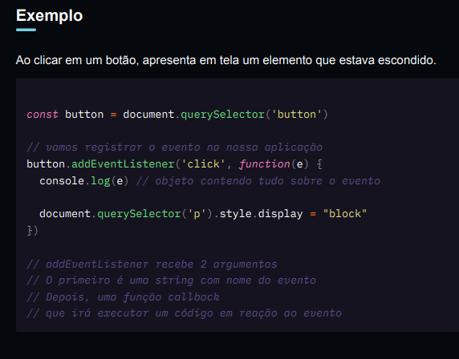

# Eventos

## Event-driven

A DOM é direcionada a eventos `Event-driven` . Significa que ela poderá reagir a qualquer tipo de evento relacionado à página.

- Podemos entender em 2 fases

  A ocorrência do evento e reação à ocorrência

## 1. Eventos

Ações que acontecem na página, site ou aplicação

- Carregamento do documento, aparição de elementos na tela
- Modificação de propriedades da página (largura, altura, scroll)
- Cliques de mouse e digitação do teclado
- Interação com sons, imagens, vídeos
- Outros

## 2. Reações

O sistema poderá executar reações às ações. Executar uma função sempre que determinada ação acontece

## Exemplo

