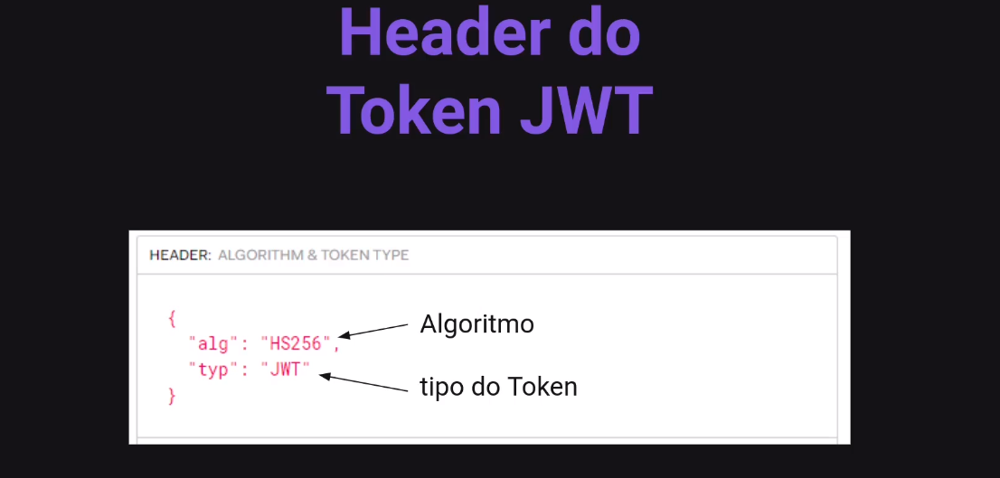

# Fluxo de Autenticação


## Usuário Autenticado


## JWT

JSON Web Token

### O que é

É um padrão de mercado que define um token no formato JSON
para a troca de informações.

### Importante

JWT não representa o mecanismo de autenticação. Mas é um meio
para a troca de informações no fluxo de autenticação.





### Web Token

```js
  npm install jsonwebtoken

  npm install multer
```

### Manipulando Arquivos

#### O módulo fs do Node.js

O módulo fs permite trabalhar e manipular arquivos.

#### Vamos passo à passo

```js
// rename: renomear ou mover o arquivo
await fs.promises.rename(
  path.resolve(uploadConfig.TMP_FOLDER, file),
  path.resolve(uploadConfig.UPLOADS_FOLDER, file)
  // path.resolve: resolver uma sequência de segmentos de caminho para um caminho absoluto.

async deleteFile(file) {
    const filePath = path.resolve(uploadConfig.UPLOADS_FOLDER, file)
    try {
      // stat: retorna o status do arquivo.
      await fs.promises.stat(filePath)
    } catch {
      return
    }
    // unlink: remove um arquivo.
    await fs.promises.unlink(filePath)
  }
)
```

### API RESTful

#### API

(Application Programming Interface)

Interface que disponibiliza um conjunto
de funcionalidades para serem
utilizadas/consumidas.

#### REST

(Representational State Transfer)

Transferência Representacional de Estado. É um modelo
de arquitetura e não uma linguagem ou tecnologia de
programação, que fornece diretrizes para que os
princípios e protocolos Web, como por exemplo, o
protocolo HTTP.

#### A API RESTful

uma API RESTful é aquela que cumpre
as diretrizes RESTFUL.

#### Diretrizes RESTful


### Cors

```js
  npm install cors

  npm install axios
```

### Contextos


#### Prop Drilling


### Hooks

Permite que você use estados e outros
recursos do React sem escrever uma classe.

Encapsula funcionalidades e facilita o
reaproveitamento da sua lógica.

#### Exemplos de Hooks


useNomeDoHook
camelCase


### Estados

#### Por que não utilizar variáveis comuns?

Variáveis não persistem entre renderizações.

Quando o React renderiza o componente uma segunda vez, ele o
renderiza do zero. Não considera nenhuma mudança nas variáveis locais.

Ou seja, as alterações em variáveis locais não irão acionar renderizações.
O React não percebe que precisa renderizar o componente novamente
com os novos dados.

#### Para atualizar um componente com novos dados, duas coisas precisam acontecer

1. Retenha os dados entre as renderizações.

2. Acione o React para renderizar o componente com novos dados (re-renderização).

#### O useState fornece essas duas coisas

1. Uma variável de estado para reter os dados entre as renderizações.

2. Uma função de configuração de estado para atualizar a variável e acionar o React para
   renderizar o componente novamente.

Em React, useState, assim como qualquer outra função que comece com "use" é chamado de Hook.

Hooks são funções especiais que só estão disponíveis enquanto o React está rendedrizando.

Quando você chama useState, você está dizendo ao React que deseja que este componente
se lembre de algo

```js
export function MyComponent() {
  const [name, setName] = useState("")

  return <h1> {name} </h1>
}
```

#### Recapitular

1. Use uma variável de estado quando um componente precisar "lembrar"
   alguma informação entre renderizações.

2. As variáveis de estado são declaradas utilizando o useState.

3. O useState retorna um par de valores: o estado atual e a função para atualizá-lo.

4. O estado é privado para o componente. Se você renderizar em dois
   lugares, cada cópia terá seu próprio estado.


uma variável normal não consegue iniciar um fluxo de renderização


quando recarrega a página, os estados são recarregados


prevState, estado anterior


Quando chegou no console.log, o estado ainda não foi atualizado!

### Local Storage

Permite armazenar informações no navegador do usuário.

#### Estrutura do Local Storage


### useEffect

#### O que o useEffect faz?

Você diz ao React que o componente precisa
fazer algo depois da renderização. Isto é,
depois que realizar as atualizações do DOM.

#### Por que useEffect é chamado dentro de um componente?

Colocando useEffect dentro do componente nos
permite acessar os estados do componente.

```js
  export function Mycomponent(){
    const [name, setName] = useState("")

    useEffect(() => {
      // O que devo fazer ?
      searchByName()
    }, [name])

    return()
  }
```


### Renderizações

#### Render

Antes dos seus componentes serem exibidos na tela eles
devem ser renderizados pelo React.

Vamos entender as etapas desse processo e do comportamento do React


