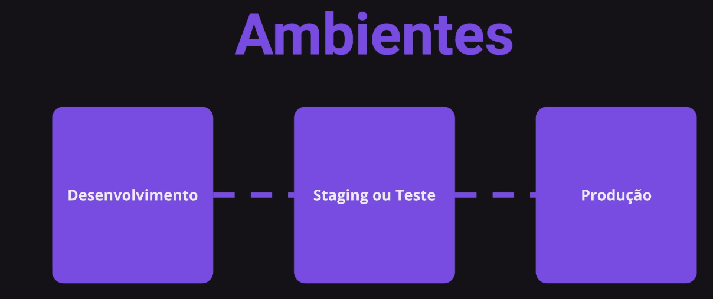
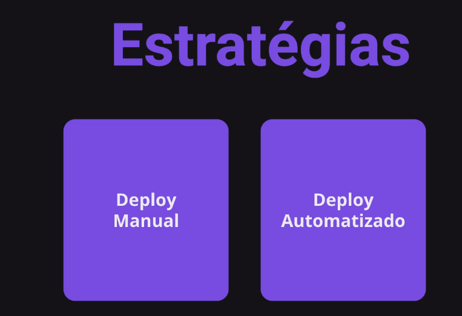
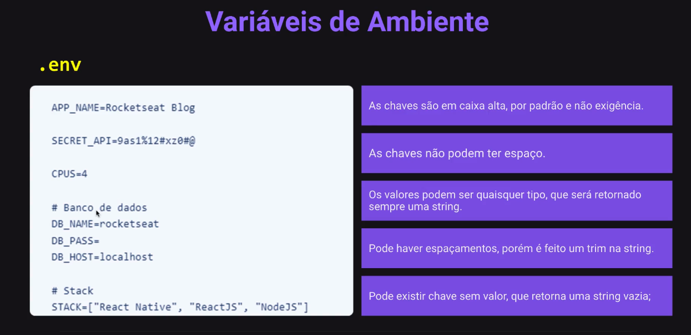

# O que é deploy

## Deploy

O deploy ou deployment significa implantar.

Significa enviar um novo projeto, mudanças ou
atualizações para um determinado ambiente.





## Dados sensíveis


### Variáveis de Ambiente



### Boas práticas e cuidados

Por se tratar de informações sensíveis na sua maioria é
importante que esses dados só fiquem em seu ambiente de
desenvolvimento, então se você pretende compartilhar seu
código lembre-se de remover esse arquivo.

Caso utilize o github basta adicionar ao .gitignore o arquivo
.env para ele fazer esse trabalho para você.

Uma boa prática também é criar um arquivo de exemplo com
as chaves que seu projeto está utilizando, sem os valores
sensíveis, assim quem clonar seu repositório ou ter acesso ao
seu fonte não ficará perdido.

Eu crio um .env.example e deixo apenas informações
genéricas como é o caso do APP_NAME.

### E no ambiente de produção?

colocar na pasta de backend

```js
  npm install dotenv --save
```

### Mantendo a API ON

PM2 é um gerenciador de processos que irá
ajudar a gerenciar e manter a aplicação online
24 horas por dia, 7 dias por semana.

```js
  npx pm2 init
```
