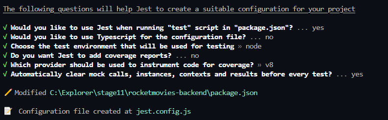
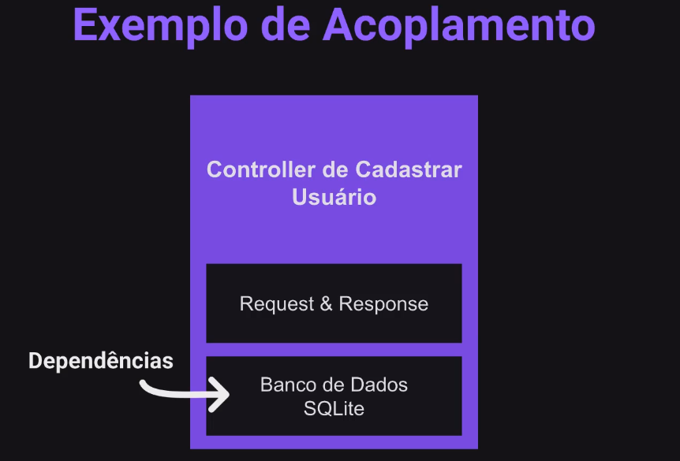
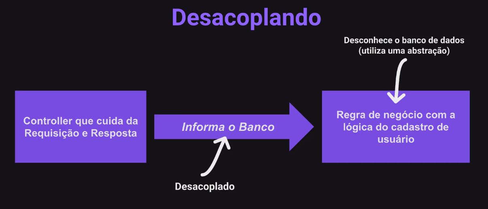
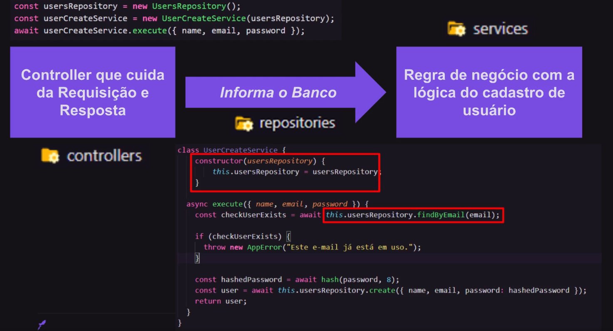

# Testes

Permite identificar erros durante o desenvolvimento e
asseguraar a qualidade e o funcionamento correto da aplicação.

## Testes Automatizado

O teste automatizado é a utilização de ferramentas de
software para automatizar um processo manual
conduzido por humanos de revisão e validação da
aplicação. Adoção ampla do método.

### Tipos de Testes


### Boas Práticas

1. Simples e rápido
   Testes simples e rápido. Isso nos possibilita ter um feedback
   o mais cedo possível sobre possíveis impactos das modificações
   feitas no software. Além disso, facilita para podermos rodar
   os teste várias vezes se necessário e torna mais ágil o debug
   dos testes, reduzindo o tempo necessário para criar e manter
   os scripts.

2. Independentes
   Os testes devem ser independentes entre si. Isso evita que a
   falha em um teste cause falha em outros testes, o que dificulta
   e torna bem mais demorada a investigação de problemas. O "você
   do futuro" vai agradecer muito ao "você do presente" por isso.

3. Ambiente
   Os testes não devem depender de ambientes ou recursos externos, como
   serviços, APIs, banco de dados, etc. O teste deve ser capaz de rodar
   a qualquer momento e quantas vezes forem necessárias.

### Jest

```js
npm install --save-dev jest

npx jest --init
```




### O Princípio de Inversão de Dependência

#### Definição

Módulos de alto nível não devem depender de módulos de
baixo nível. Ambos devem depender de abstrações.
Abstrações não devem depender de detalhes.
Detalhes devem depender de abstrações. (MARTIN 1996)

#### Resumindo o Objetivo

Desacoplar e diminuir a dependência entre
regra de negócio e infraestrutura.

#### Controlando o Acoplamento

De maneira geral, será praticamente impossível criar
uma aplicação onde a arquitetura seja totalmente
desacoplada e abstrata, pois acoplamentos concretos
sempre existirão.

#### O Segredo

O segredo está em saber diferenciar os acoplamentos
ruins dos acoplamentos bons, pois assim "modelaremos
nossos sistemas fugindo dos "acoplamentos perigosos".

#### Exemplo de Acoplamento



#### Desacoplando




