# O que é uma API?

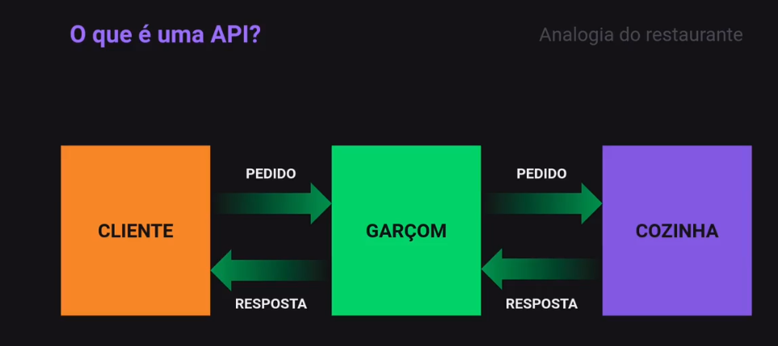

API - Application Programming Interface, ou
Interface de Programação de Aplicação é um termo
para designar uma interface de comunicação que um
sistema oferece para que outros acessem suas funções.

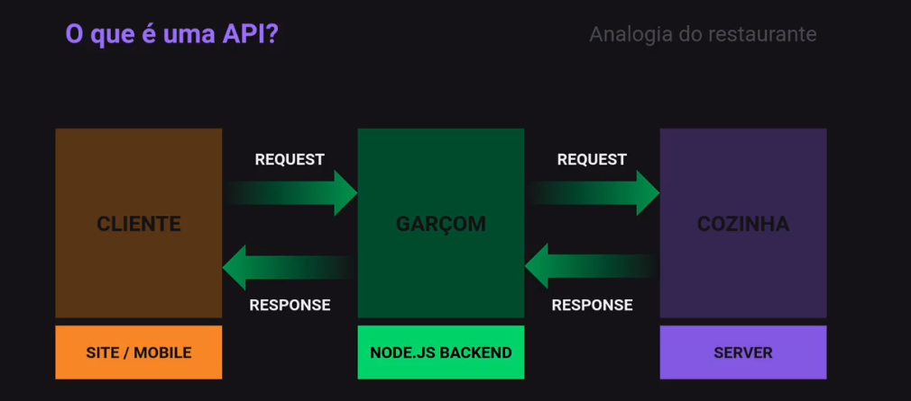

## O que é o Node.js

### Linguagem

Node.js não é uma linguagem de programação.

Javascript é a linguagem de programação.

### JS Runtime Enviroment

Ele é um ambiente que oferece recursos
que permite escrever e executar
aplicações Javascript.

### Para que serve Node.js?

Serve para fazer o que voce quiser,
desde sites à scripts de automação.
Incluindo, a criação de API.

### Onde o Node pode ser utilizado?

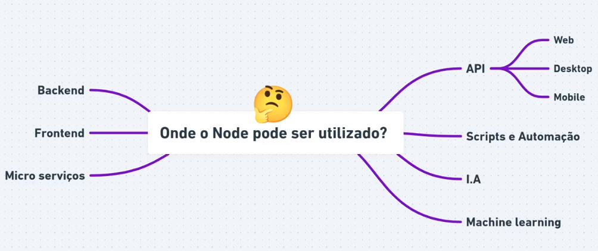

### Vantagens

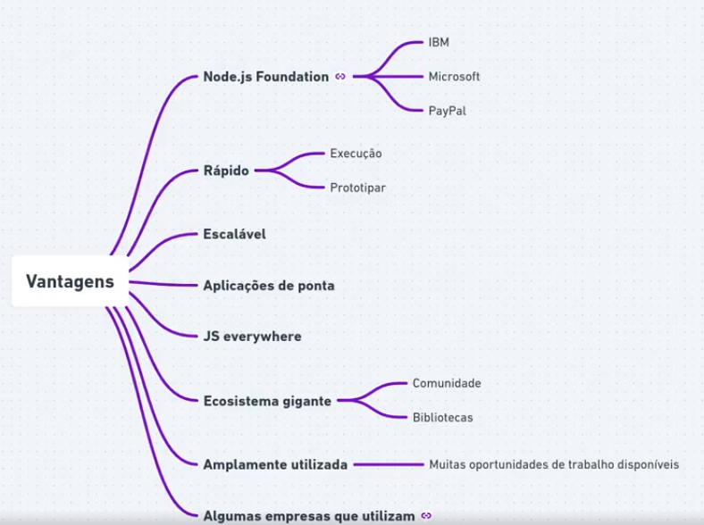

### o que é o v8 Engine?

v8 é o interpretador JavaScript.
Desenvolvido pela Google e utilizado
em seu navegador Google Chrome.

O v8 foi desenvolvido em C++ com o objetivo
de aumentar a performance de execução do Javascript.

### O funcionamento do Node.js

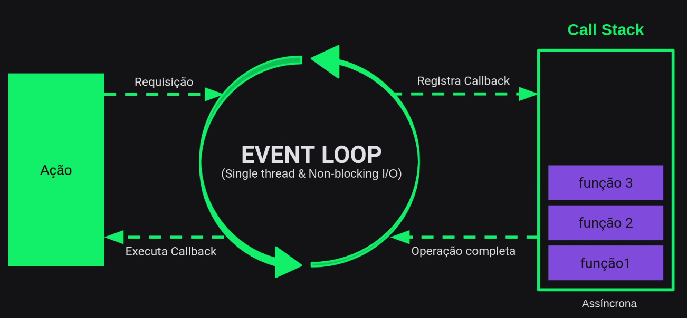

```js
npm install express --save
```

## Rota

### O Que é uma rota?

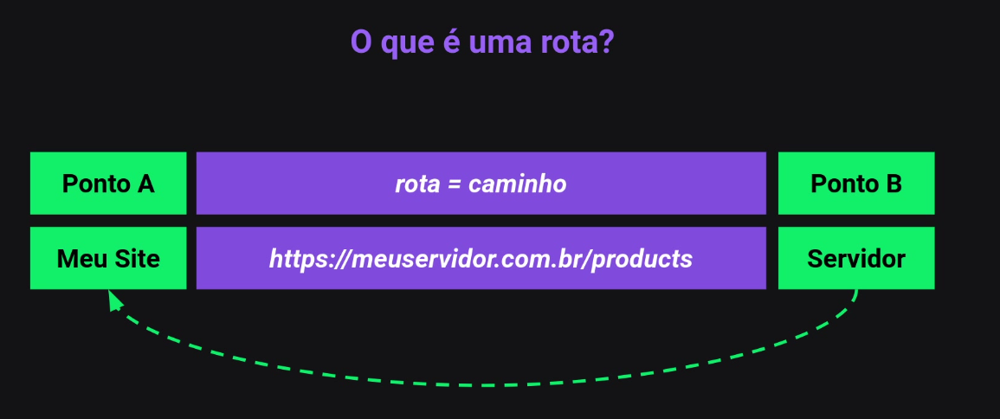

### Métodos de requisições

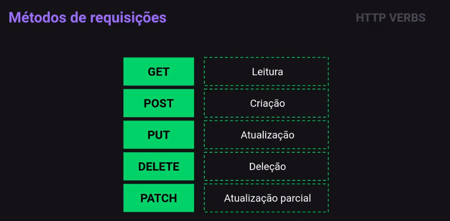

### Route Params


### Query Params

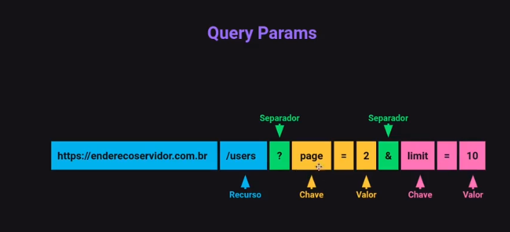

Query Params são opcionais pro caminho da rota,
já route é obrigatório

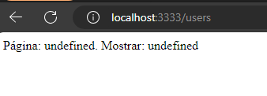


### Nodemon

```js
npm run dev
// npm install nodemon --save--dev
// para ficar apenas no desenvolvimento,
// ao atualizar reinicia o servidor, automaticamente
```

### Estrutura inicial do nosso projeto

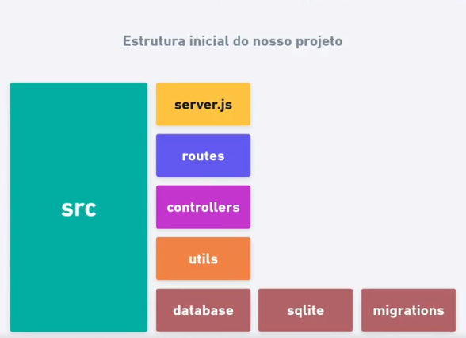

### HTTP Codes

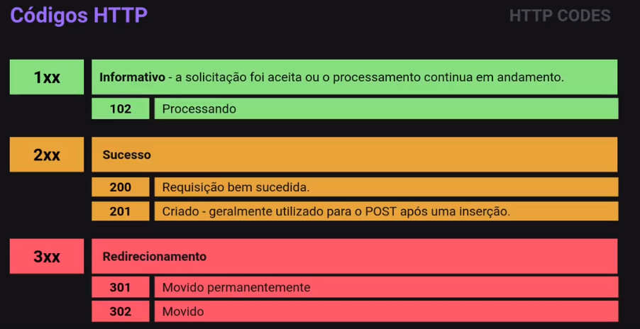

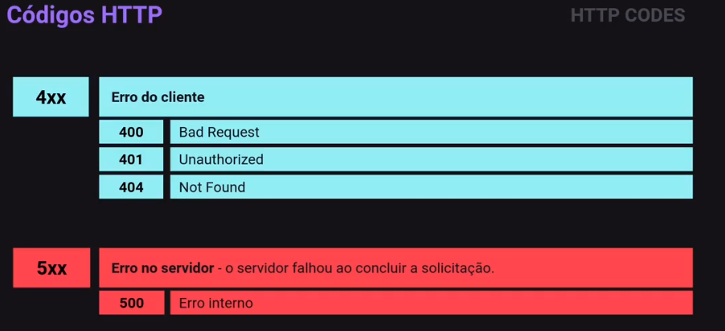

### Middleware

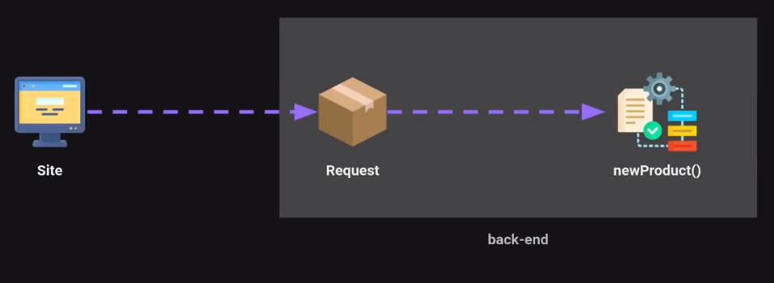

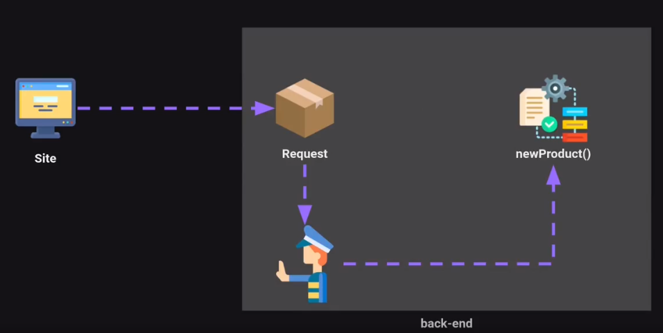

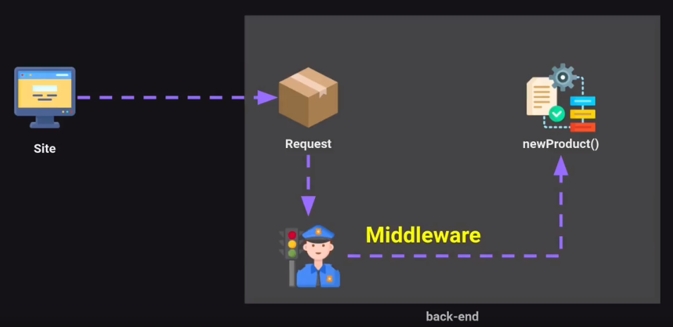

Middleware são funções que tem acesso ao objeto de
solicitação (requisição), o objeto de resposta (resposta), e a
próxima função de middleware no ciclo solicitação-resposta do
aplicativo.

A próxima função middleware é comumente denotada por uma
variável chamada next.

### Middleware podem

- Executar qualquer código.

- Fazer mudanças nos objetos de solicitação e resposta.

- Encerrar o ciclo de solicitação-resposta.

- Chamar o próximo middleware da pilha.

```js
npm install express-async-errors --save
```
