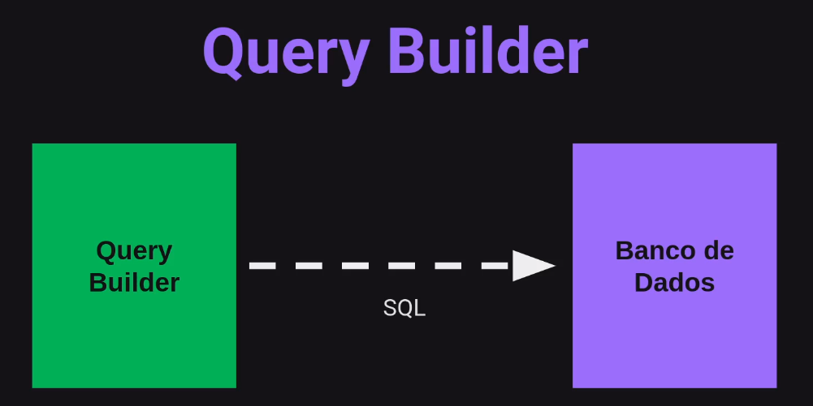
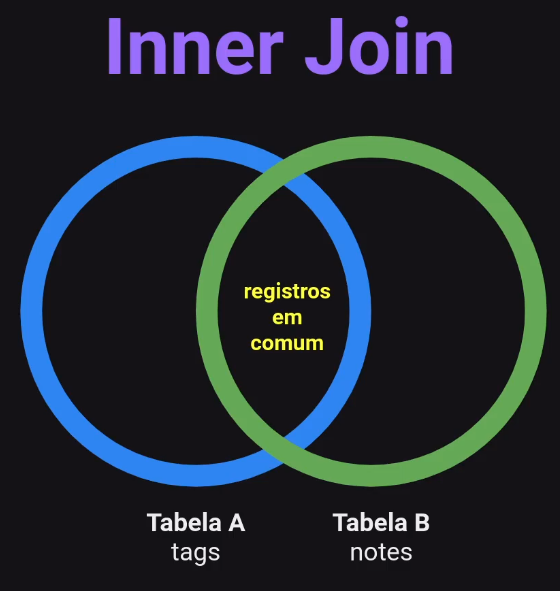
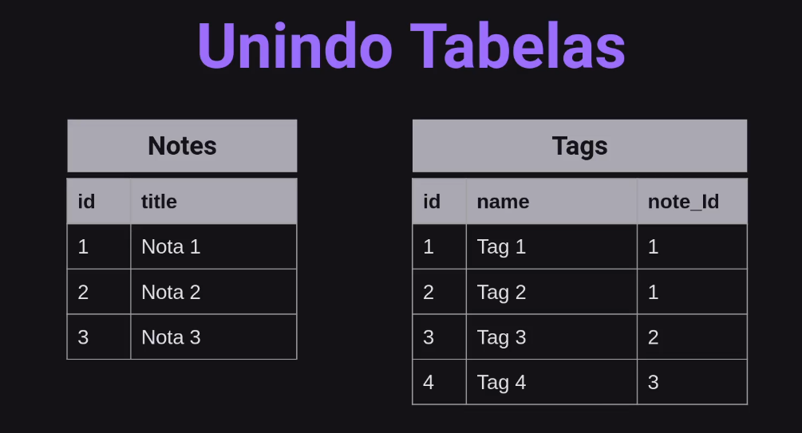
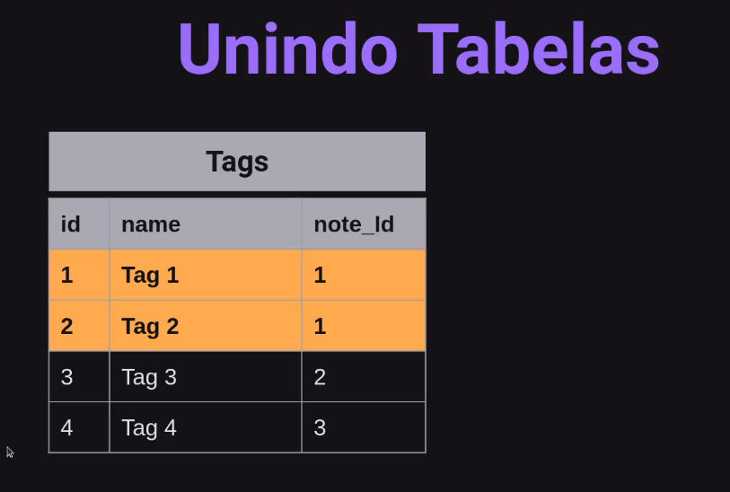
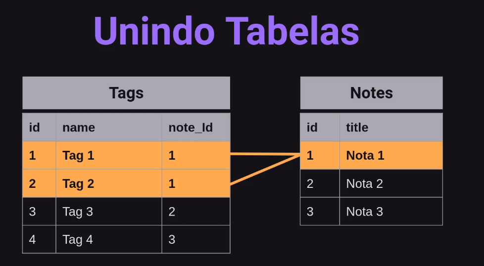
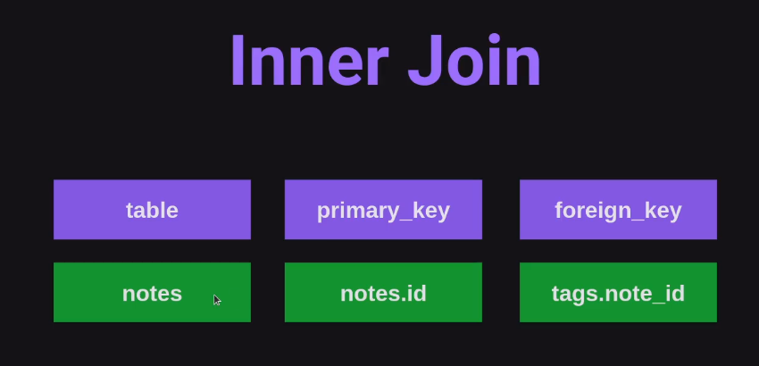

# SQL Query Builder

Query Builder é um Construtor de
Consulta.

O Query Builder permite que você
construa instruções SQL independente do
banco de dados utilizado.



```js
npx knex init
```

## Migrations

É uma forma de versionar a base de
dados.

Migrations trabalha na manipulação da
base de dados: criando, alterando ou
removendo.

### Métodos de uma Migrations

UP: método responsável por criar ou alterar algo no
banco de dados.

DOWN: responsável pelo rollback. Ou seja, desfazer
as alterações realizadas pela migration.

```js
npx knex migrate:make createNotes

npx knex migrate:latest
```

### NPM

Node Package Manager é o gerenciador
de pacotes padrão para Node.js

Os pacotes e módulos necessários no
projeto Node são instalados usando npm.

E também utilizamos o npm para
executar scripts e bibliotecas instaladas.

### NPX

O npx significa Node Package Execute e vem
com o npm acima da versão 5.2.

É um executor de pacotes npm que pode
executar qualquer pacote que você quiser do
registro npm sem sequer instalar esse pacote.

### Resumindo

NPM é uma ferramenta que usa para INSTALAR pacotes.

NPX é uma ferramenta que usa para EXECUTAR pacotes.

### Esquema do BD

Nessa aula aprenderemos o que é Cardinalidade, ou seja a frequência que uma tabela se relaciona com a outra. Para isso, vamos visualizar a estrutura do nosso banco de dados.


Um usuário pode ter várias notas,
uma nota pode ter apenas um usuário (desse esquema).

A chave estrangeira (Foreign key) tem a
finalidade de conectar tabelas

```js
npx knex migrate:make createTags
```

### Inner Join












### MAP e FILTER

<https://playcode.io/>

```js
const tags = [
  { id: 1, name: "node", note_id: 1 },
  { id: 2, name: "express", note_id: 1 },
  { id: 3, name: "react", note_id: 1 },
  { id: 4, name: "javascript", note_id: 2 },
  { id: 5, name: "frontend", note_id: 2 },
]

// const newArray = tags.map(tag => tag.name)
// const newArray = tags.map(tag => {
//   return{
//     name: tag.name
//   }
// })
const newArray = tags.map((tag) => {
  return {
    ...tag,
    date: new Date(),
  }
})
const filterArray = tags.filter((tag) => tag.note_id === 1)
// console.log(newArray)
console.log(filterArray)
```

MAP: manipular um array e devolver um novo array
FILTER: filtrar algum dado do array
