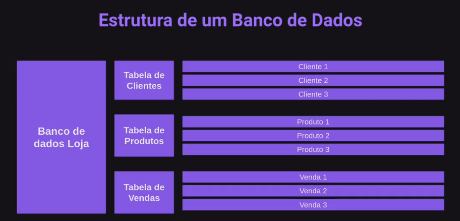
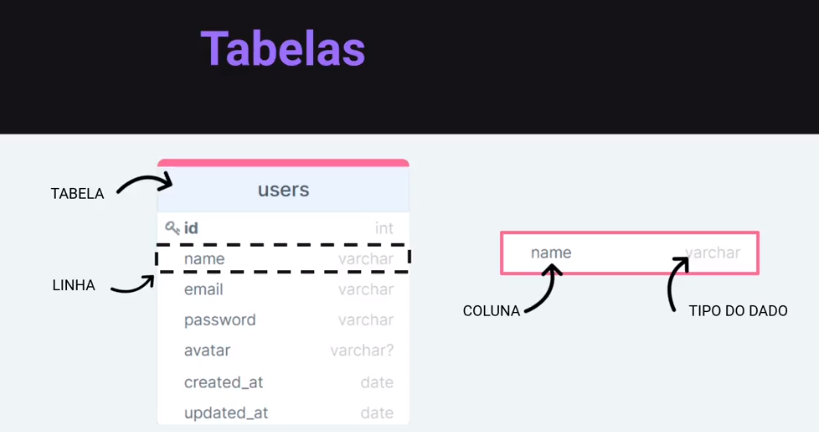
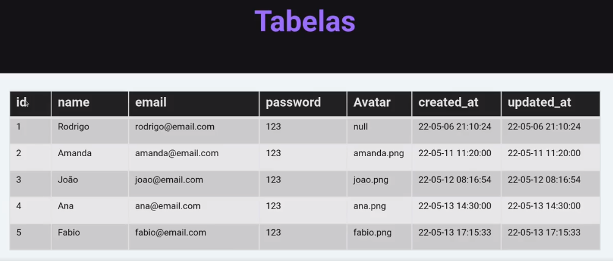
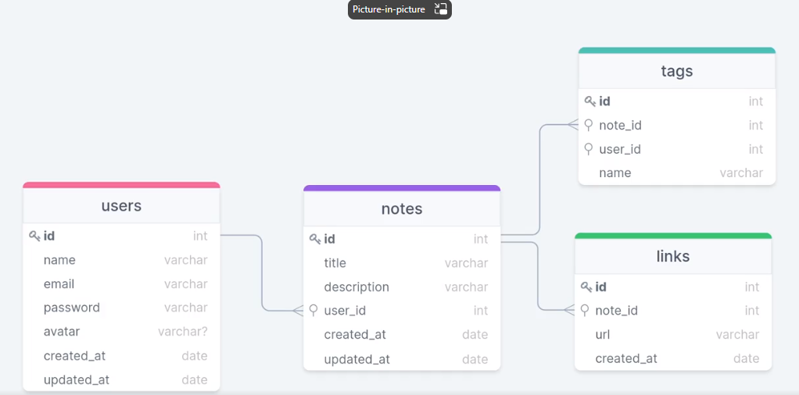
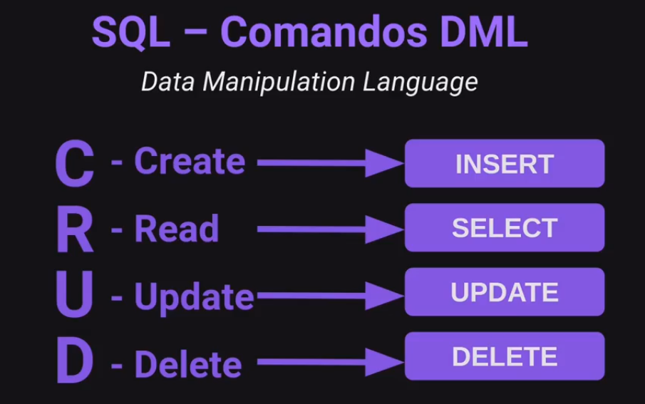

# O que é um banco de dados?


## Estrutura de um banco de dados



### Tabelas





### Banco de dados relacional


### Estrutura da base de dados



```js
npm install sqlite3 sqlite --save
```

### SQL

Structured Query Language, ou
Linguagem de Consulta Estruturada.

É a linguagem padrão para banco de
dados relacionais.

### SQL Comandos DDL

Data Definition Language

CREATE

DROP

ALTER

### SQL Comandos DML

Data Manipulation Language (CRUD)



### Criptografar senha

npm install bcryptjs
