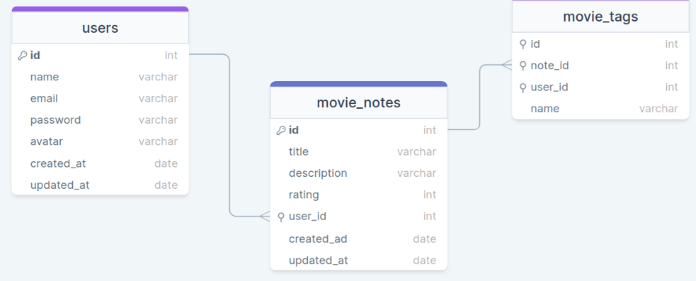
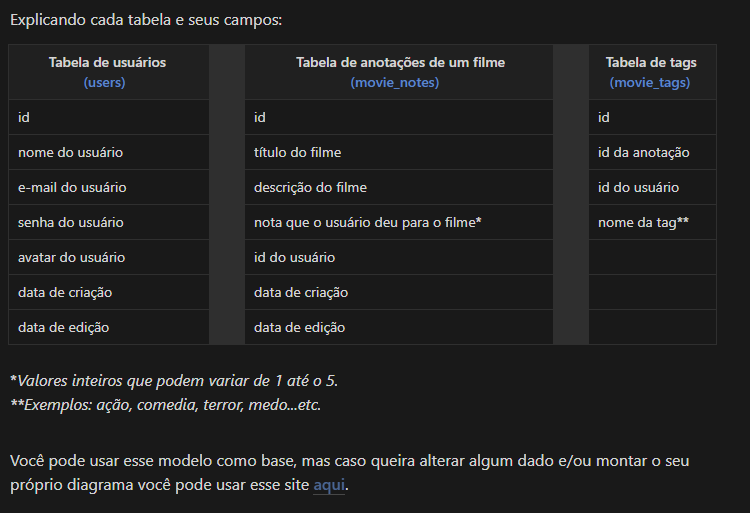

# Mapa

A ideia agora é criar uma aplicação em Node.js onde o usuário cadastra um filme, preenche com algumas informações (nome, descrição, nota) e cria tags relacionadas a ele.
Abaixo, temos um diagrama que você pode usar como base:

<https://efficient-sloth-d85.notion.site/Aplica-o-em-Node-57bd49ae77b3422fad74f8dde0d06fef>

<https://drawsql.app/>
