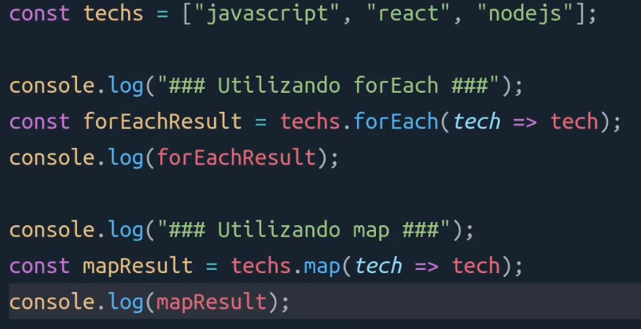

# Comandos

```js
npm create vite@latest

//y
// nome do projeto
// React
// JS
// cd rocketnotes
//  npm install
//  npm run dev
```

## CSS, Pré Processadores, CSS-in-Js

### O CSS

O CSS evoluiu muito desde o seu lançamento e continua evoluindo.


A evolução continua...

### Pré Processadores


### Vantagens de utilizar um Pré Processador

Facilita a manutenção do código, ajuda a escrever um
código mais limpo e organizado utilizando vários arquivos
para separar os códigos e realizando a importação quando
for necessário tornando os códigos CSS mais flexíveis e
reutilizáveis.

Possui recursos, como por exemplo, de MINIFICAR arquivos.


Mas o CSS continua tendo desafios.
Por exemplo, lidar com ESPECIFICIDADE E COLISÃO DE ESTILOS.


Fácil, "é só aninhar", certo?

.minha-classe > section > header > div > h1 {}

### Elementos aninhados

Muito elementos aninhados impacta na performance, porquê
elementos aninhados são mais lentos para carregar.

E o CSS sozinho não possui mecanismos para evitar que
isso aconteça.

### CSS-in-Js

CSS-in-JS fazem muito sentido, porque aproveitam métodos
atuais de componentização JavaScript para criar
componentes performáticos a prova de colisão.

E tudo isso é extremamente automatizado.

### Styled Components

Foi desenvolvido para melhorar a maneira que lidamos
com CSS nos componentes de aplicações React.

### Vantagens

Sem colisão de classes: fornece nomes de classes a prova de colisão.

Desempenho: Como funciona diretamente nos componentes, ele consegue analisar
facilmente quais códigos serão ou não usados, inclusive os que são adicionados
após interação do usuário. O que também ajuda a diminuir o código final.

Estilo dinâmico: permite adaptar os estilos baseando nas props recebidas, é
possível criar estilos dinâmicos de forma fácil e intuitiva.

Manutenção sem dor: Tudo que você precisa vai estar no próprio contexto de componente,
facilitando encontrar tudo o que você precisa para o desenvolvimento.

Boas práticas: Você escreve seu CSS no melhor padrão do mercado e pronto, os
componentes cuidam para fornecer suporte para browsers antigos.

CSS in JS
Nessa aula aprenderemos o que é o styled-components e como adicionar em nosso projeto.\n
Acesse aqui a documentação do styled-components

Como instalar o styled-components?
De acordo com a documentação, para instalar o styled-components, digite o comando abaixo no terminal (dentro da pasta do projeto):

```js
npm install --save styled-components

```

Código do arquivo styles.js (antes styles.css):

```js
import styled from "styled-components"

export const Container = styled.div`
  background-color: red;
`
```

Código do arquivo index.js em /Details:

```js
import { Container } from "./styles"

export function Details() {
  return (
    <Container>
      <h1>Hello World</h1>
    </Container>
  )
}
```

### Arrow Function

#### Functions

```js
function sum(a, b) {
  return a + b
}
const result = sum(7, 3)
```

#### Arrow-Function

```js
const result = (7,3) => {
  return a + b
}

body{
  background-color: ${({ theme }) => theme.COLORS.BACKGROUND_800};
  color: ${({ theme }) => theme.COLORS.WHITE};
}

${ (props) => props.theme.COLORS.BACKGROUND_800}
// desistruturar
${ ({props}) => theme.COLORS.BACKGROUND_800}

```

```js
  npm install react-icons --save
```

### Map

```js
const tags = [
  { id: "1", name: "react" },
  { id: "2", name: "nodejs" },
]
// O Map tem como objetivo, percorer cada item que
// existe dentro de uma lista
<footer>
  {tags.map( tag => <Tag key={tag.id} title={tag.name}/>)}
<footer>
```


#### Por quê Map e não forEach?


Colocando para retornar algo, o forEach retorna
undefined(ou seja, não retorna) e o map a lista




Utilizamos o map, pois precisamos devolver um
novo componente na tela

#### Por que utilizar key em itens de listas ?


### Importação de Imagem

```js
import userImg from "../../assets/vinicius.png"
;
```

```js
import BackgroundImg from "../../assets/background.png"

export const Background = styled.div`
  flex: 1;
  background: ulr(${backgroundImg}) no-repeat center center;
  background-size: cover;
`
```

```js
  npm install react-router-dom
```
